# Sơ đồ sequence — OKR360 V1

> Trạng thái thiết kế: TARGET V1
>
> Trạng thái triển khai: Tài liệu thiết kế, chưa triển khai

Mỗi use case có một sơ đồ sequence, cùng số với use case: SD-12 là UC12. Sơ đồ cho thấy thứ tự các class trong [sơ đồ class](class-diagrams.md) phối hợp với nhau, kèm các nhánh lỗi chính.

Quy ước:

- Mọi yêu cầu trừ đăng nhập đi qua `JwtAuthGuard` và `RolesGuard` trước khi tới controller; bước này chỉ vẽ ở SD-12 và SD-23.
- Lỗi trả về theo định dạng Problem Details qua `ProblemDetailsFilter`.
- Các luồng AI chạy nền dùng chung một đường ống, vẽ đầy đủ ở SD-32; SD-08, SD-12, SD-30 và SD-31 chỉ vẽ phần riêng của luồng mình.

| Mã                                                       | Use case                                     | API                                                                        |
| -------------------------------------------------------- | -------------------------------------------- | -------------------------------------------------------------------------- |
| [SD-01](#sd-01--đăng-nhập)                               | UC01 Đăng nhập                               | `login`                                                                    |
| [SD-02](#sd-02--đăng-xuất)                               | UC02 Đăng xuất                               | `logout`                                                                   |
| [SD-03](#sd-03--quản-lý-hồ-sơ-cá-nhân)                   | UC03 Quản lý hồ sơ cá nhân                   | `getProfile`, `updateProfile`, `changePassword`                            |
| [SD-04](#sd-04--quản-lý-phòng-ban-và-team)               | UC04 Quản lý phòng ban và team               | `createDepartment`, `updateDepartment`, `deactivateDepartment`             |
| [SD-05](#sd-05--quản-lý-người-dùng)                      | UC05 Quản lý người dùng                      | `createUser`, `updateUser`, `updateUserStatus`                             |
| [SD-06](#sd-06--quản-lý-chu-kỳ-okr)                      | UC06 Quản lý chu kỳ OKR                      | `createCycle`, `activateCycle`, `closeCycle`                               |
| [SD-07](#sd-07--xem-cây-okr)                             | UC07 Xem cây OKR                             | `getObjectiveTree`, `getObjective`                                         |
| [SD-08](#sd-08--tạosửa-objective)                        | UC08 Tạo/sửa Objective                       | `createObjective`, `updateObjective`                                       |
| [SD-09](#sd-09--quản-lý-key-result)                      | UC09 Quản lý Key Result                      | `createKeyResult`, `updateKeyResult`, `deleteKeyResult`                    |
| [SD-10](#sd-10--liên-kết-lên-mục-tiêu-cấp-trên)          | UC10 Liên kết lên mục tiêu cấp trên          | `linkParentObjective`                                                      |
| [SD-11](#sd-11--xóa-mềm-okr)                             | UC11 Xóa mềm OKR                             | `deleteObjective`                                                          |
| [SD-12](#sd-12--check-in-key-result)                     | UC12 Check-in Key Result                     | `createCheckin`                                                            |
| [SD-13](#sd-13--xem-lịch-sử-check-in-và-biểu-đồ-tiến-độ) | UC13 Xem lịch sử check-in và biểu đồ tiến độ | `listCheckins`                                                             |
| [SD-14](#sd-14--phản-hồi-check-in)                       | UC14 Phản hồi check-in                       | `createCheckinComment`                                                     |
| [SD-15](#sd-15--quản-lý-bộ-tiêu-chí-đánh-giá)            | UC15 Quản lý bộ tiêu chí đánh giá            | `createTemplate`, `updateTemplate`, `duplicateTemplate`                    |
| [SD-16](#sd-16--tạo-và-mở-đợt-đánh-giá-360)              | UC16 Tạo và mở đợt đánh giá 360              | `createCampaign`, `openNomination`, `openCollection`                       |
| [SD-17](#sd-17--đề-cử-đồng-nghiệp)                       | UC17 Đề cử đồng nghiệp                       | `getMyNomination`, `submitNomination`                                      |
| [SD-18](#sd-18--duyệt-người-đánh-giá)                    | UC18 Duyệt người đánh giá                    | `listPendingNominations`, `approveNomination`                              |
| [SD-19](#sd-19--điền-phiếu-đánh-giá)                     | UC19 Điền phiếu đánh giá                     | `checkReviewComment`, `submitReviewForm`                                   |
| [SD-20](#sd-20--theo-dõi-tiến-độ-nộp-phiếu-và-đóng-đợt)  | UC20 Theo dõi tiến độ nộp phiếu và đóng đợt  | `getCampaignProgress`, `remindReviewers`, `closeCampaign`                  |
| [SD-21](#sd-21--xem-kết-quả-360)                         | UC21 Xem kết quả 360                         | `getReviewResult`                                                          |
| [SD-22](#sd-22--tổng-hợp-và-công-bố-kết-quả-cuối-kỳ)     | UC22 Tổng hợp và công bố kết quả cuối kỳ     | `calculateFinalResults`, `publishFinalResults`                             |
| [SD-23](#sd-23--xem-dashboard)                           | UC23 Xem dashboard                           | `getMyDashboard`, `getTeamDashboard`, `getCompanyDashboard`                |
| [SD-24](#sd-24--xem-và-xuất-báo-cáo)                     | UC24 Xem và xuất báo cáo                     | `getReport`, `exportReport`                                                |
| [SD-25](#sd-25--nhận-thông-báo-và-nhắc-nhở)              | UC25 Nhận thông báo và nhắc nhở              | Worker, `listNotifications`, `markNotificationRead`                        |
| [SD-26](#sd-26--xem-nhật-ký-hoạt-động)                   | UC26 Xem nhật ký hoạt động                   | `listAuditLogs`                                                            |
| [SD-27](#sd-27--cấu-hình-luồng-tự-động)                  | UC27 Cấu hình luồng tự động                  | `updateAutomationFlow`                                                     |
| [SD-28](#sd-28--xem-lịch-sử-chạy-tự-động)                | UC28 Xem lịch sử chạy tự động                | `listAutomationRuns`, `getAutomationRun`, `retryAutomationRun`             |
| [SD-29](#sd-29--xử-lý-vướng-mắc-được-chuyển-đến)         | UC29 Xử lý vướng mắc được chuyển đến         | `acknowledgeBlocker`, `rejectBlocker`                                      |
| [SD-30](#sd-30--xem-bản-tin-tuần)                        | UC30 Xem bản tin tuần                        | Worker, `getWeeklyDigest`                                                  |
| [SD-31](#sd-31--duyệt-bản-nháp-1-1)                      | UC31 Duyệt bản nháp 1-1                      | Worker, `updateOneOnOneDraft`, `sendOneOnOneDraft`, `discardOneOnOneDraft` |
| [SD-32](#sd-32--chạy-luồng-tự-động-ai)                   | UC32 Chạy luồng tự động AI                   | Worker                                                                     |

## SD-01 — Đăng nhập

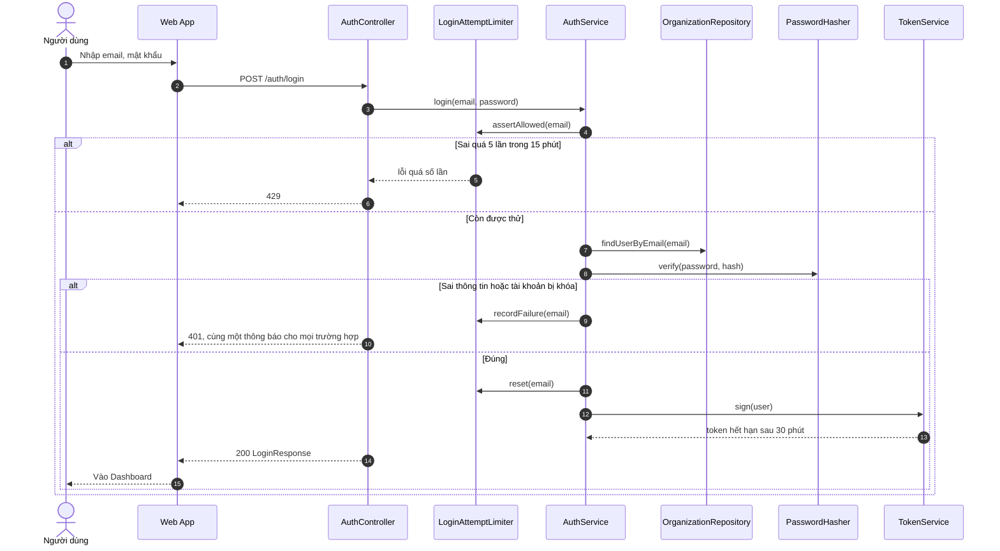
```mermaid
sequenceDiagram
    autonumber
    actor U as Người dùng
    participant W as Web App
    participant C as AuthController
    participant L as LoginAttemptLimiter
    participant S as AuthService
    participant R as OrganizationRepository
    participant H as PasswordHasher
    participant T as TokenService

    U->>W: Nhập email, mật khẩu
    W->>C: POST /auth/login
    C->>S: login(email, password)
    S->>L: assertAllowed(email)
    alt Sai quá 5 lần trong 15 phút
        L-->>C: lỗi quá số lần
        C-->>W: 429
    else Còn được thử
        S->>R: findUserByEmail(email)
        S->>H: verify(password, hash)
        alt Sai thông tin hoặc tài khoản bị khóa
            S->>L: recordFailure(email)
            C-->>W: 401, cùng một thông báo cho mọi trường hợp
        else Đúng
            S->>L: reset(email)
            S->>T: sign(user)
            T-->>S: token hết hạn sau 30 phút
            C-->>W: 200 LoginResponse
            W-->>U: Vào Dashboard
        end
    end
```

## SD-02 — Đăng xuất

V1 không thu hồi token ở server; token tự hết hạn sau 30 phút.

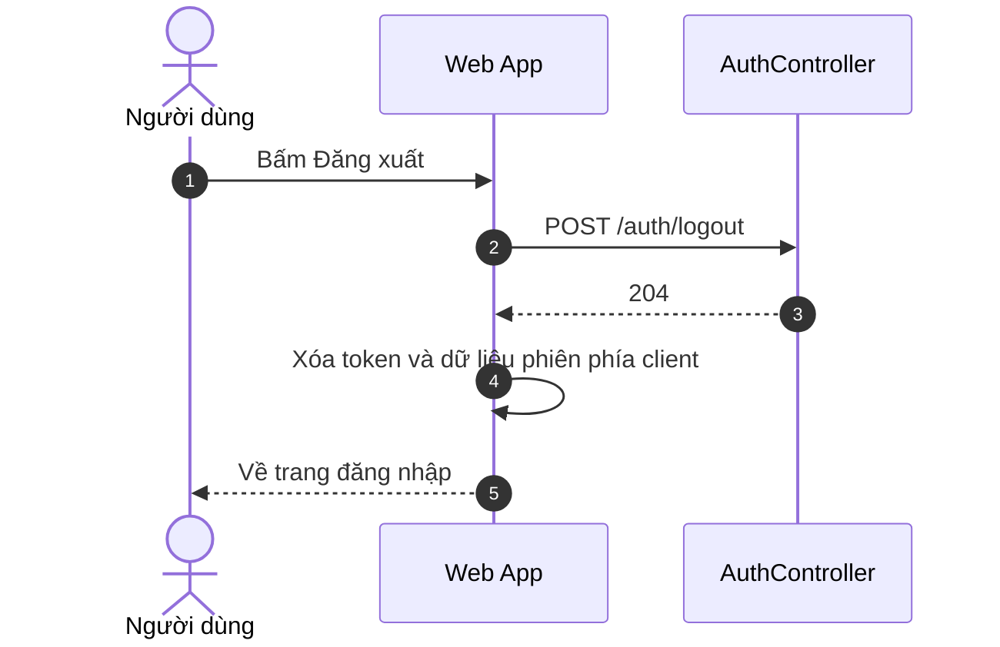
```mermaid
sequenceDiagram
    autonumber
    actor U as Người dùng
    participant W as Web App
    participant C as AuthController

    U->>W: Bấm Đăng xuất
    W->>C: POST /auth/logout
    C-->>W: 204
    W->>W: Xóa token và dữ liệu phiên phía client
    W-->>U: Về trang đăng nhập
```

## SD-03 — Quản lý hồ sơ cá nhân

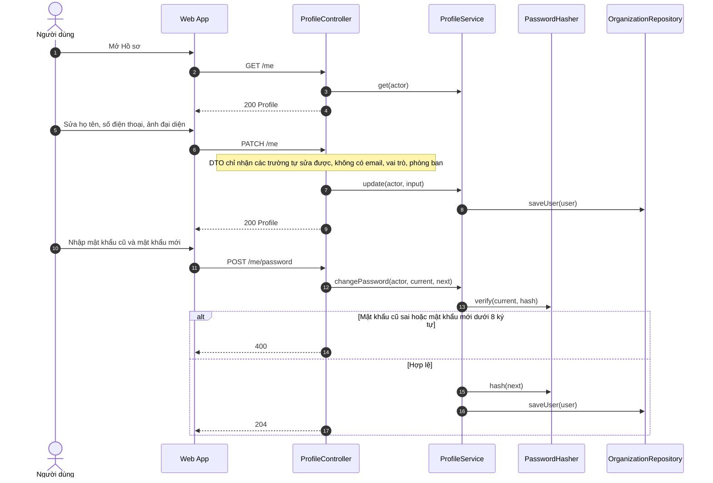
```mermaid
sequenceDiagram
    autonumber
    actor U as Người dùng
    participant W as Web App
    participant C as ProfileController
    participant S as ProfileService
    participant H as PasswordHasher
    participant R as OrganizationRepository

    U->>W: Mở Hồ sơ
    W->>C: GET /me
    C->>S: get(actor)
    C-->>W: 200 Profile
    U->>W: Sửa họ tên, số điện thoại, ảnh đại diện
    W->>C: PATCH /me
    Note over C: DTO chỉ nhận các trường tự sửa được, không có email, vai trò, phòng ban
    C->>S: update(actor, input)
    S->>R: saveUser(user)
    C-->>W: 200 Profile
    U->>W: Nhập mật khẩu cũ và mật khẩu mới
    W->>C: POST /me/password
    C->>S: changePassword(actor, current, next)
    S->>H: verify(current, hash)
    alt Mật khẩu cũ sai hoặc mật khẩu mới dưới 8 ký tự
        C-->>W: 400
    else Hợp lệ
        S->>H: hash(next)
        S->>R: saveUser(user)
        C-->>W: 204
    end
```

## SD-04 — Quản lý phòng ban và team

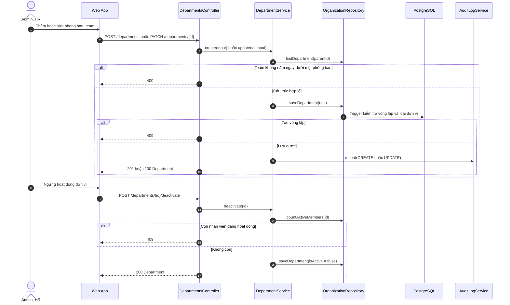
```mermaid
sequenceDiagram
    autonumber
    actor A as Admin, HR
    participant W as Web App
    participant C as DepartmentsController
    participant S as DepartmentService
    participant R as OrganizationRepository
    participant DB as PostgreSQL
    participant L as AuditLogService

    A->>W: Thêm hoặc sửa phòng ban, team
    W->>C: POST /departments hoặc PATCH /departments/{id}
    C->>S: create(input) hoặc update(id, input)
    S->>R: findDepartment(parentId)
    alt Team không nằm ngay dưới một phòng ban
        C-->>W: 400
    else Cấu trúc hợp lệ
        S->>R: saveDepartment(unit)
        R->>DB: Trigger kiểm tra vòng lặp và loại đơn vị
        alt Tạo vòng lặp
            C-->>W: 409
        else Lưu được
            S->>L: record(CREATE hoặc UPDATE)
            C-->>W: 201 hoặc 200 Department
        end
    end
    A->>W: Ngưng hoạt động đơn vị
    W->>C: POST /departments/{id}/deactivate
    C->>S: deactivate(id)
    S->>R: countActiveMembers(id)
    alt Còn nhân viên đang hoạt động
        C-->>W: 409
    else Không còn
        S->>R: saveDepartment(isActive = false)
        C-->>W: 200 Department
    end
```

## SD-05 — Quản lý người dùng

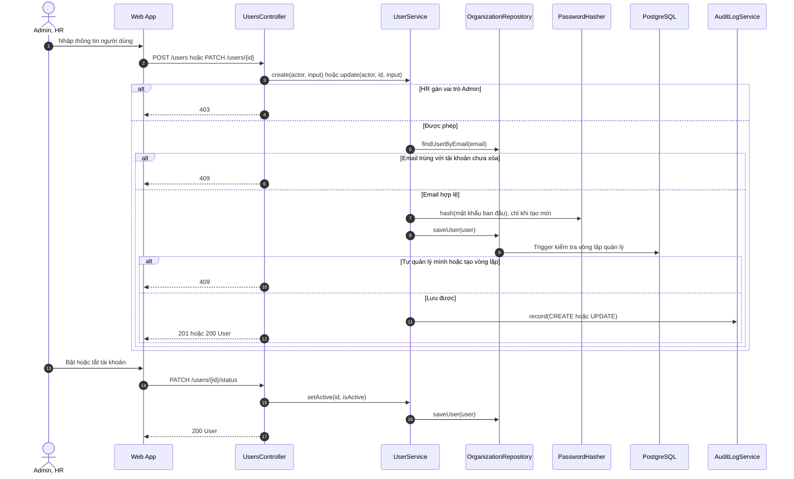
```mermaid
sequenceDiagram
    autonumber
    actor A as Admin, HR
    participant W as Web App
    participant C as UsersController
    participant S as UserService
    participant R as OrganizationRepository
    participant H as PasswordHasher
    participant DB as PostgreSQL
    participant L as AuditLogService

    A->>W: Nhập thông tin người dùng
    W->>C: POST /users hoặc PATCH /users/{id}
    C->>S: create(actor, input) hoặc update(actor, id, input)
    alt HR gán vai trò Admin
        C-->>W: 403
    else Được phép
        S->>R: findUserByEmail(email)
        alt Email trùng với tài khoản chưa xóa
            C-->>W: 409
        else Email hợp lệ
            S->>H: hash(mật khẩu ban đầu), chỉ khi tạo mới
            S->>R: saveUser(user)
            R->>DB: Trigger kiểm tra vòng lặp quản lý
            alt Tự quản lý mình hoặc tạo vòng lặp
                C-->>W: 409
            else Lưu được
                S->>L: record(CREATE hoặc UPDATE)
                C-->>W: 201 hoặc 200 User
            end
        end
    end
    A->>W: Bật hoặc tắt tài khoản
    W->>C: PATCH /users/{id}/status
    C->>S: setActive(id, isActive)
    S->>R: saveUser(user)
    C-->>W: 200 User
```

- Tài khoản bị tắt không đăng nhập được và không được phân công làm người đánh giá mới (BR-014).

## SD-06 — Quản lý chu kỳ OKR

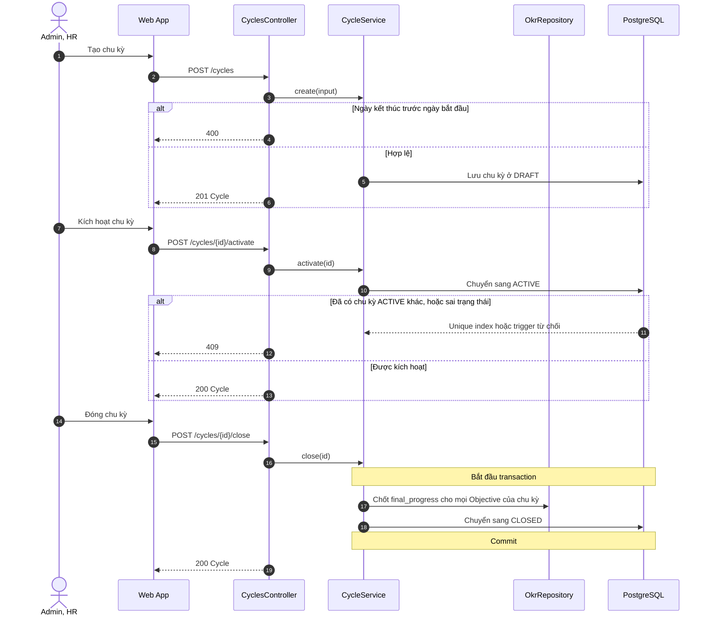
```mermaid
sequenceDiagram
    autonumber
    actor A as Admin, HR
    participant W as Web App
    participant C as CyclesController
    participant S as CycleService
    participant R as OkrRepository
    participant DB as PostgreSQL

    A->>W: Tạo chu kỳ
    W->>C: POST /cycles
    C->>S: create(input)
    alt Ngày kết thúc trước ngày bắt đầu
        C-->>W: 400
    else Hợp lệ
        S->>DB: Lưu chu kỳ ở DRAFT
        C-->>W: 201 Cycle
    end
    A->>W: Kích hoạt chu kỳ
    W->>C: POST /cycles/{id}/activate
    C->>S: activate(id)
    S->>DB: Chuyển sang ACTIVE
    alt Đã có chu kỳ ACTIVE khác, hoặc sai trạng thái
        DB-->>S: Unique index hoặc trigger từ chối
        C-->>W: 409
    else Được kích hoạt
        C-->>W: 200 Cycle
    end
    A->>W: Đóng chu kỳ
    W->>C: POST /cycles/{id}/close
    C->>S: close(id)
    Note over S,DB: Bắt đầu transaction
    S->>R: Chốt final_progress cho mọi Objective của chu kỳ
    S->>DB: Chuyển sang CLOSED
    Note over S,DB: Commit
    C-->>W: 200 Cycle
```

- Từ lúc đóng, trigger chặn mọi thao tác sửa OKR và check-in trong chu kỳ (BR-022).

## SD-07 — Xem cây OKR

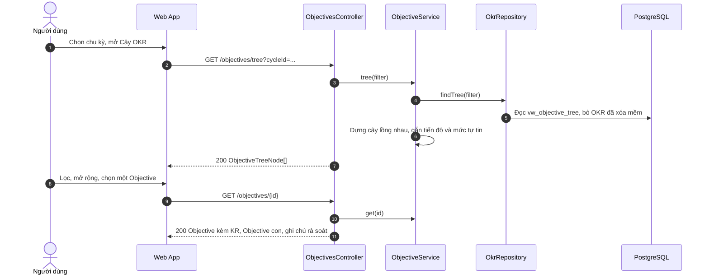
```mermaid
sequenceDiagram
    autonumber
    actor U as Người dùng
    participant W as Web App
    participant C as ObjectivesController
    participant S as ObjectiveService
    participant R as OkrRepository
    participant DB as PostgreSQL

    U->>W: Chọn chu kỳ, mở Cây OKR
    W->>C: GET /objectives/tree?cycleId=...
    C->>S: tree(filter)
    S->>R: findTree(filter)
    R->>DB: Đọc vw_objective_tree, bỏ OKR đã xóa mềm
    S->>S: Dựng cây lồng nhau, gắn tiến độ và mức tự tin
    C-->>W: 200 ObjectiveTreeNode[]
    U->>W: Lọc, mở rộng, chọn một Objective
    W->>C: GET /objectives/{id}
    C->>S: get(id)
    C-->>W: 200 Objective kèm KR, Objective con, ghi chú rà soát
```

## SD-08 — Tạo/sửa Objective

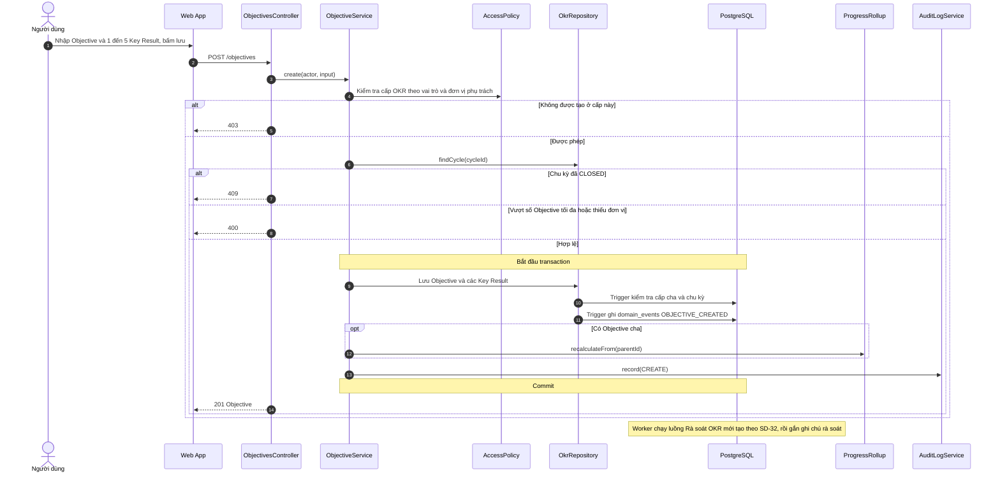
```mermaid
sequenceDiagram
    autonumber
    actor U as Người dùng
    participant W as Web App
    participant C as ObjectivesController
    participant S as ObjectiveService
    participant P as AccessPolicy
    participant R as OkrRepository
    participant DB as PostgreSQL
    participant RU as ProgressRollup
    participant L as AuditLogService

    U->>W: Nhập Objective và 1 đến 5 Key Result, bấm lưu
    W->>C: POST /objectives
    C->>S: create(actor, input)
    S->>P: Kiểm tra cấp OKR theo vai trò và đơn vị phụ trách
    alt Không được tạo ở cấp này
        C-->>W: 403
    else Được phép
        S->>R: findCycle(cycleId)
        alt Chu kỳ đã CLOSED
            C-->>W: 409
        else Vượt số Objective tối đa hoặc thiếu đơn vị
            C-->>W: 400
        else Hợp lệ
            Note over S,DB: Bắt đầu transaction
            S->>R: Lưu Objective và các Key Result
            R->>DB: Trigger kiểm tra cấp cha và chu kỳ
            R->>DB: Trigger ghi domain_events OBJECTIVE_CREATED
            opt Có Objective cha
                S->>RU: recalculateFrom(parentId)
            end
            S->>L: record(CREATE)
            Note over S,DB: Commit
            C-->>W: 201 Objective
        end
    end
    Note over DB: Worker chạy luồng Rà soát OKR mới tạo theo SD-32, rồi gắn ghi chú rà soát
```

- Sửa Objective (`updateObjective`) đi theo cùng mẫu, không ghi sự kiện cho AI.

## SD-09 — Quản lý Key Result

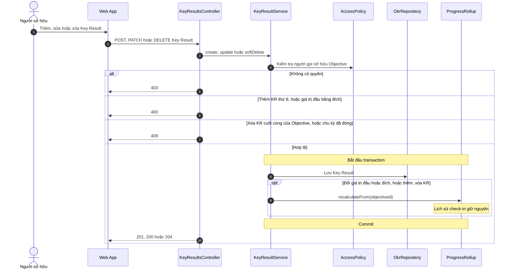
```mermaid
sequenceDiagram
    autonumber
    actor U as Người sở hữu
    participant W as Web App
    participant C as KeyResultsController
    participant S as KeyResultService
    participant P as AccessPolicy
    participant R as OkrRepository
    participant RU as ProgressRollup

    U->>W: Thêm, sửa hoặc xóa Key Result
    W->>C: POST, PATCH hoặc DELETE Key Result
    C->>S: create, update hoặc softDelete
    S->>P: Kiểm tra người gọi sở hữu Objective
    alt Không có quyền
        C-->>W: 403
    else Thêm KR thứ 6, hoặc giá trị đầu bằng đích
        C-->>W: 400
    else Xóa KR cuối cùng của Objective, hoặc chu kỳ đã đóng
        C-->>W: 409
    else Hợp lệ
        Note over S,RU: Bắt đầu transaction
        S->>R: Lưu Key Result
        opt Đổi giá trị đầu hoặc đích, hoặc thêm, xóa KR
            S->>RU: recalculateFrom(objectiveId)
            Note over RU: Lịch sử check-in giữ nguyên
        end
        Note over S,RU: Commit
        C-->>W: 201, 200 hoặc 204
    end
```

## SD-10 — Liên kết lên mục tiêu cấp trên

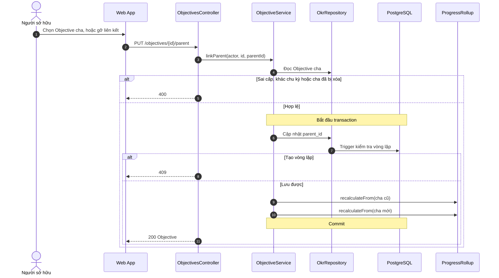
```mermaid
sequenceDiagram
    autonumber
    actor U as Người sở hữu
    participant W as Web App
    participant C as ObjectivesController
    participant S as ObjectiveService
    participant R as OkrRepository
    participant DB as PostgreSQL
    participant RU as ProgressRollup

    U->>W: Chọn Objective cha, hoặc gỡ liên kết
    W->>C: PUT /objectives/{id}/parent
    C->>S: linkParent(actor, id, parentId)
    S->>R: Đọc Objective cha
    alt Sai cấp, khác chu kỳ hoặc cha đã bị xóa
        C-->>W: 400
    else Hợp lệ
        Note over S,DB: Bắt đầu transaction
        S->>R: Cập nhật parent_id
        R->>DB: Trigger kiểm tra vòng lặp
        alt Tạo vòng lặp
            C-->>W: 409
        else Lưu được
            S->>RU: recalculateFrom(cha cũ)
            S->>RU: recalculateFrom(cha mới)
            Note over S,DB: Commit
            C-->>W: 200 Objective
        end
    end
```

## SD-11 — Xóa mềm OKR

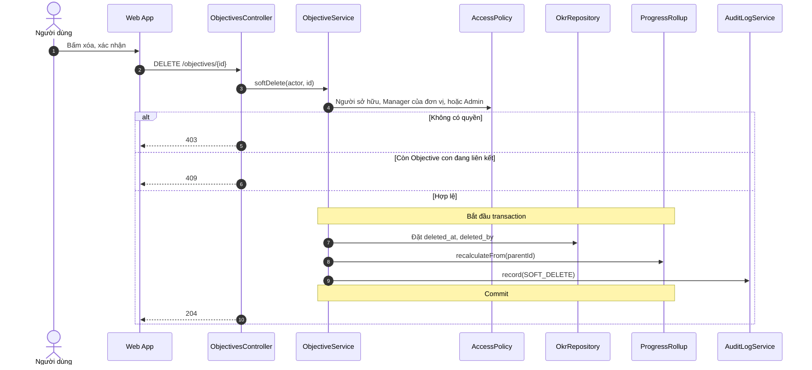
```mermaid
sequenceDiagram
    autonumber
    actor U as Người dùng
    participant W as Web App
    participant C as ObjectivesController
    participant S as ObjectiveService
    participant P as AccessPolicy
    participant R as OkrRepository
    participant RU as ProgressRollup
    participant L as AuditLogService

    U->>W: Bấm xóa, xác nhận
    W->>C: DELETE /objectives/{id}
    C->>S: softDelete(actor, id)
    S->>P: Người sở hữu, Manager của đơn vị, hoặc Admin
    alt Không có quyền
        C-->>W: 403
    else Còn Objective con đang liên kết
        C-->>W: 409
    else Hợp lệ
        Note over S,RU: Bắt đầu transaction
        S->>R: Đặt deleted_at, deleted_by
        S->>RU: recalculateFrom(parentId)
        S->>L: record(SOFT_DELETE)
        Note over S,RU: Commit
        C-->>W: 204
    end
```

## SD-12 — Check-in Key Result

Mọi bước ghi nằm trong một transaction. AI không được gọi ở đây: trigger chỉ ghi sự kiện, Worker xử lý sau (SD-32).

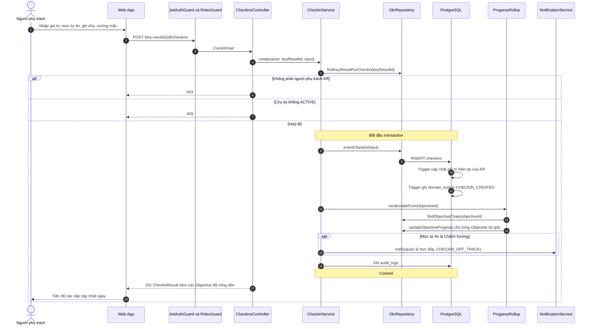
```mermaid
sequenceDiagram
    autonumber
    actor U as Người phụ trách
    participant W as Web App
    participant G as JwtAuthGuard và RolesGuard
    participant C as CheckinsController
    participant S as CheckinService
    participant R as OkrRepository
    participant DB as PostgreSQL
    participant P as ProgressRollup
    participant N as NotificationService

    U->>W: Nhập giá trị, mức tự tin, ghi chú, vướng mắc
    W->>G: POST /key-results/{id}/checkins
    G->>C: CurrentUser
    C->>S: create(actor, keyResultId, input)
    S->>R: findKeyResultForCheckin(keyResultId)
    alt Không phải người phụ trách KR
        C-->>W: 403
    else Chu kỳ không ACTIVE
        C-->>W: 409
    else Hợp lệ
        Note over S,DB: Bắt đầu transaction
        S->>R: insertCheckin(input)
        R->>DB: INSERT checkins
        DB->>DB: Trigger cập nhật giá trị hiện tại của KR
        DB->>DB: Trigger ghi domain_events CHECKIN_CREATED
        S->>P: recalculateFrom(objectiveId)
        P->>R: findObjectiveChain(objectiveId)
        P->>R: updateObjectiveProgress cho từng Objective tới gốc
        opt Mức tự tin là Chệch hướng
            S->>N: notify(quản lý trực tiếp, CHECKIN_OFF_TRACK)
        end
        S->>DB: Ghi audit_logs
        Note over S,DB: Commit
        C-->>W: 201 CheckinResult kèm các Objective đã cộng dồn
        W-->>U: Tiến độ các cấp cập nhật ngay
    end
```

## SD-13 — Xem lịch sử check-in và biểu đồ tiến độ

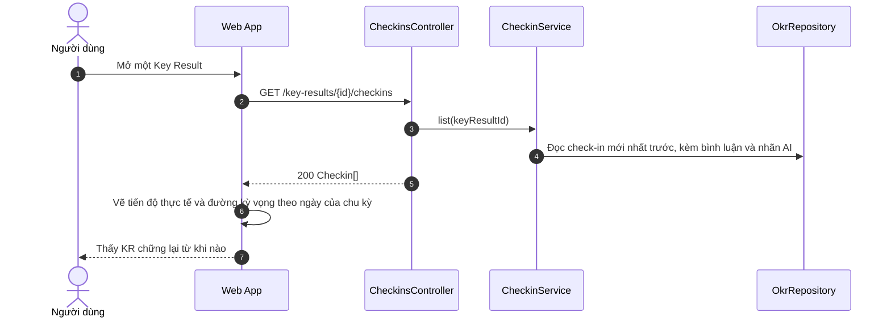
```mermaid
sequenceDiagram
    autonumber
    actor U as Người dùng
    participant W as Web App
    participant C as CheckinsController
    participant S as CheckinService
    participant R as OkrRepository

    U->>W: Mở một Key Result
    W->>C: GET /key-results/{id}/checkins
    C->>S: list(keyResultId)
    S->>R: Đọc check-in mới nhất trước, kèm bình luận và nhãn AI
    C-->>W: 200 Checkin[]
    W->>W: Vẽ tiến độ thực tế và đường kỳ vọng theo ngày của chu kỳ
    W-->>U: Thấy KR chững lại từ khi nào
```

## SD-14 — Phản hồi check-in

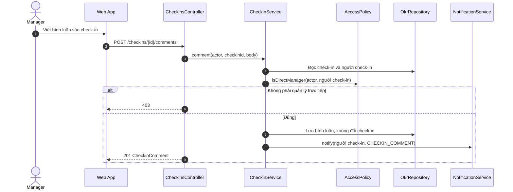
```mermaid
sequenceDiagram
    autonumber
    actor M as Manager
    participant W as Web App
    participant C as CheckinsController
    participant S as CheckinService
    participant P as AccessPolicy
    participant R as OkrRepository
    participant N as NotificationService

    M->>W: Viết bình luận vào check-in
    W->>C: POST /checkins/{id}/comments
    C->>S: comment(actor, checkinId, body)
    S->>R: Đọc check-in và người check-in
    S->>P: isDirectManager(actor, người check-in)
    alt Không phải quản lý trực tiếp
        C-->>W: 403
    else Đúng
        S->>R: Lưu bình luận, không đổi check-in
        S->>N: notify(người check-in, CHECKIN_COMMENT)
        C-->>W: 201 CheckinComment
    end
```

## SD-15 — Quản lý bộ tiêu chí đánh giá

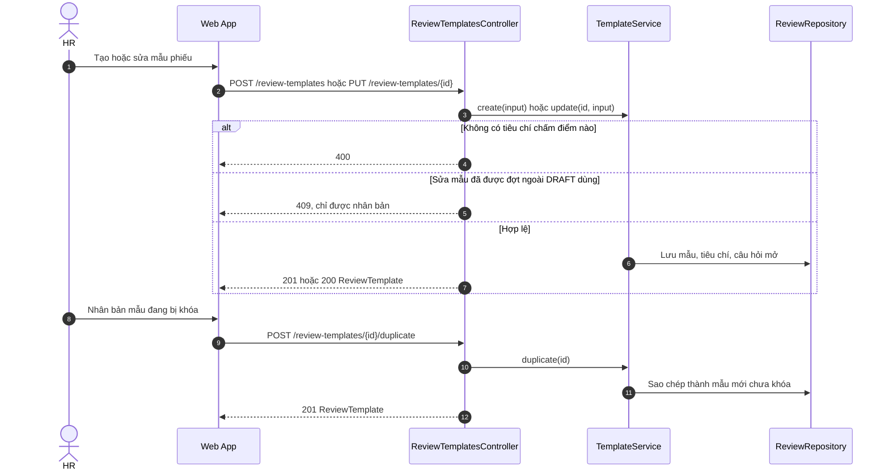
```mermaid
sequenceDiagram
    autonumber
    actor HR as HR
    participant W as Web App
    participant C as ReviewTemplatesController
    participant S as TemplateService
    participant R as ReviewRepository

    HR->>W: Tạo hoặc sửa mẫu phiếu
    W->>C: POST /review-templates hoặc PUT /review-templates/{id}
    C->>S: create(input) hoặc update(id, input)
    alt Không có tiêu chí chấm điểm nào
        C-->>W: 400
    else Sửa mẫu đã được đợt ngoài DRAFT dùng
        C-->>W: 409, chỉ được nhân bản
    else Hợp lệ
        S->>R: Lưu mẫu, tiêu chí, câu hỏi mở
        C-->>W: 201 hoặc 200 ReviewTemplate
    end
    HR->>W: Nhân bản mẫu đang bị khóa
    W->>C: POST /review-templates/{id}/duplicate
    C->>S: duplicate(id)
    S->>R: Sao chép thành mẫu mới chưa khóa
    C-->>W: 201 ReviewTemplate
```

## SD-16 — Tạo và mở đợt đánh giá 360

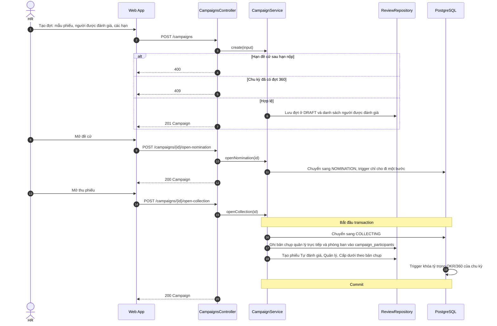
```mermaid
sequenceDiagram
    autonumber
    actor HR as HR
    participant W as Web App
    participant C as CampaignsController
    participant S as CampaignService
    participant R as ReviewRepository
    participant DB as PostgreSQL

    HR->>W: Tạo đợt: mẫu phiếu, người được đánh giá, các hạn
    W->>C: POST /campaigns
    C->>S: create(input)
    alt Hạn đề cử sau hạn nộp
        C-->>W: 400
    else Chu kỳ đã có đợt 360
        C-->>W: 409
    else Hợp lệ
        S->>R: Lưu đợt ở DRAFT và danh sách người được đánh giá
        C-->>W: 201 Campaign
    end
    HR->>W: Mở đề cử
    W->>C: POST /campaigns/{id}/open-nomination
    C->>S: openNomination(id)
    S->>DB: Chuyển sang NOMINATION, trigger chỉ cho đi một bước
    C-->>W: 200 Campaign
    HR->>W: Mở thu phiếu
    W->>C: POST /campaigns/{id}/open-collection
    C->>S: openCollection(id)
    Note over S,DB: Bắt đầu transaction
    S->>DB: Chuyển sang COLLECTING
    S->>R: Ghi bản chụp quản lý trực tiếp và phòng ban vào campaign_participants
    S->>R: Tạo phiếu Tự đánh giá, Quản lý, Cấp dưới theo bản chụp
    DB->>DB: Trigger khóa tỷ trọng OKR/360 của chu kỳ
    Note over S,DB: Commit
    C-->>W: 200 Campaign
```

- Phiếu nhóm Đồng nghiệp được tạo khi duyệt người đánh giá (SD-18).

## SD-17 — Đề cử đồng nghiệp

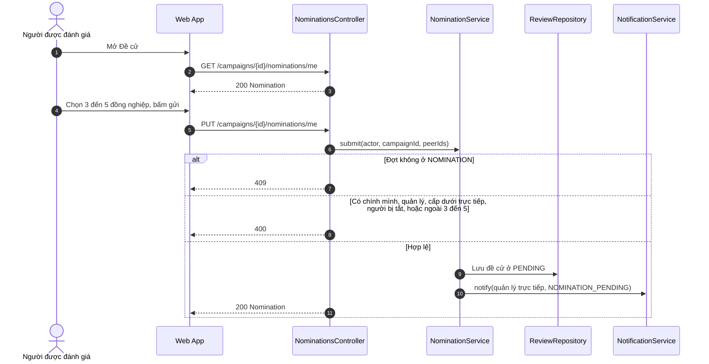
```mermaid
sequenceDiagram
    autonumber
    actor U as Người được đánh giá
    participant W as Web App
    participant C as NominationsController
    participant S as NominationService
    participant R as ReviewRepository
    participant N as NotificationService

    U->>W: Mở Đề cử
    W->>C: GET /campaigns/{id}/nominations/me
    C-->>W: 200 Nomination
    U->>W: Chọn 3 đến 5 đồng nghiệp, bấm gửi
    W->>C: PUT /campaigns/{id}/nominations/me
    C->>S: submit(actor, campaignId, peerIds)
    alt Đợt không ở NOMINATION
        C-->>W: 409
    else Có chính mình, quản lý, cấp dưới trực tiếp, người bị tắt, hoặc ngoài 3 đến 5
        C-->>W: 400
    else Hợp lệ
        S->>R: Lưu đề cử ở PENDING
        S->>N: notify(quản lý trực tiếp, NOMINATION_PENDING)
        C-->>W: 200 Nomination
    end
```

## SD-18 — Duyệt người đánh giá

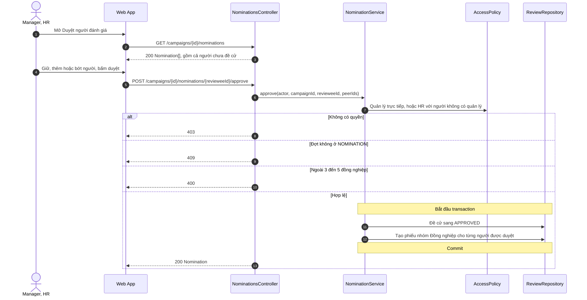
```mermaid
sequenceDiagram
    autonumber
    actor M as Manager, HR
    participant W as Web App
    participant C as NominationsController
    participant S as NominationService
    participant P as AccessPolicy
    participant R as ReviewRepository

    M->>W: Mở Duyệt người đánh giá
    W->>C: GET /campaigns/{id}/nominations
    C-->>W: 200 Nomination[], gồm cả người chưa đề cử
    M->>W: Giữ, thêm hoặc bớt người, bấm duyệt
    W->>C: POST /campaigns/{id}/nominations/{revieweeId}/approve
    C->>S: approve(actor, campaignId, revieweeId, peerIds)
    S->>P: Quản lý trực tiếp, hoặc HR với người không có quản lý
    alt Không có quyền
        C-->>W: 403
    else Đợt không ở NOMINATION
        C-->>W: 409
    else Ngoài 3 đến 5 đồng nghiệp
        C-->>W: 400
    else Hợp lệ
        Note over S,R: Bắt đầu transaction
        S->>R: Đề cử sang APPROVED
        S->>R: Tạo phiếu nhóm Đồng nghiệp cho từng người được duyệt
        Note over S,R: Commit
        C-->>W: 200 Nomination
    end
```

## SD-19 — Điền phiếu đánh giá

Luồng này chạy ngay trong API, không qua hộp thư sự kiện và không ghi lịch sử chạy.

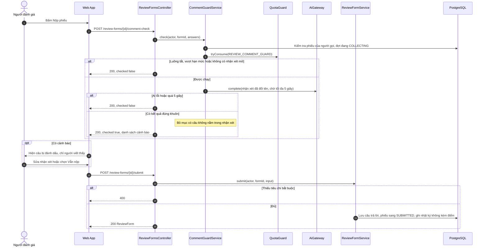
```mermaid
sequenceDiagram
    autonumber
    actor U as Người đánh giá
    participant W as Web App
    participant C as ReviewFormsController
    participant G as CommentGuardService
    participant Q as QuotaGuard
    participant A as AiGateway
    participant F as ReviewFormService
    participant DB as PostgreSQL

    U->>W: Bấm Nộp phiếu
    W->>C: POST /review-forms/{id}/comment-check
    C->>G: check(actor, formId, answers)
    G->>DB: Kiểm tra phiếu của người gọi, đợt đang COLLECTING
    G->>Q: tryConsume(REVIEW_COMMENT_GUARD)
    alt Luồng tắt, vượt hạn mức hoặc không có nhận xét mở
        C-->>W: 200, checked false
    else Được chạy
        G->>A: complete(nhận xét đã đổi tên, chờ tối đa 5 giây)
        alt AI lỗi hoặc quá 5 giây
            C-->>W: 200, checked false
        else Có kết quả đúng khuôn
            Note over G: Bỏ mục có câu không nằm trong nhận xét
            C-->>W: 200, checked true, danh sách cảnh báo
        end
    end
    opt Có cảnh báo
        W-->>U: Hiện câu bị đánh dấu, chỉ người viết thấy
        U->>W: Sửa nhận xét hoặc chọn Vẫn nộp
    end
    W->>C: POST /review-forms/{id}/submit
    C->>F: submit(actor, formId, input)
    alt Thiếu tiêu chí bắt buộc
        C-->>W: 400
    else Đủ
        F->>DB: Lưu câu trả lời, phiếu sang SUBMITTED, ghi nhật ký không kèm điểm
        C-->>W: 200 ReviewForm
    end
```

- Cảnh báo không được lưu ở đâu cả; chỉ `automation_daily_usage` được cộng một lần gọi (BR-101, NFR-PRIV-006).

## SD-20 — Theo dõi tiến độ nộp phiếu và đóng đợt

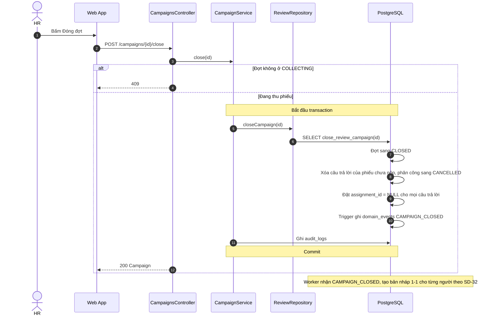
```mermaid
sequenceDiagram
    autonumber
    actor HR as HR
    participant W as Web App
    participant C as CampaignsController
    participant S as CampaignService
    participant R as ReviewRepository
    participant DB as PostgreSQL

    HR->>W: Bấm Đóng đợt
    W->>C: POST /campaigns/{id}/close
    C->>S: close(id)
    alt Đợt không ở COLLECTING
        C-->>W: 409
    else Đang thu phiếu
        Note over S,DB: Bắt đầu transaction
        S->>R: closeCampaign(id)
        R->>DB: SELECT close_review_campaign(id)
        DB->>DB: Đợt sang CLOSED
        DB->>DB: Xóa câu trả lời của phiếu chưa nộp, phân công sang CANCELLED
        DB->>DB: Đặt assignment_id = NULL cho mọi câu trả lời
        DB->>DB: Trigger ghi domain_events CAMPAIGN_CLOSED
        S->>DB: Ghi audit_logs
        Note over S,DB: Commit
        C-->>W: 200 Campaign
    end
    Note over DB: Worker nhận CAMPAIGN_CLOSED, tạo bản nháp 1-1 cho từng người theo SD-32
```

- Sau bước đặt `assignment_id = NULL`, ngay cả người đọc được toàn bộ database cũng không nối được điểm với người chấm (NFR-PRIV-001).

## SD-21 — Xem kết quả 360

```mermaid
sequenceDiagram
    autonumber
    actor U as Người dùng
    participant W as Web App
    participant C as ReviewResultsController
    participant S as ReviewResultService
    participant P as AccessPolicy
    participant R as ReviewRepository
    participant G as AnonymityAggregator

    U->>W: Mở kết quả 360
    W->>C: GET /campaigns/{id}/results/{revieweeId}
    C->>S: get(actor, campaignId, revieweeId)
    S->>P: canViewReviewResult(actor, campaign, revieweeId)
    Note over P: Bản thân khi PUBLISHED, quản lý trực tiếp theo bản chụp khi CLOSED, HR luôn được, Admin chỉ bản thân
    alt Không được xem
        C-->>W: 403
    else Được xem
        S->>R: groupScores(campaignId, revieweeId)
        S->>R: visibleComments(campaignId, revieweeId)
        S->>G: aggregate(điểm theo nhóm, nhận xét)
        Note over G: Nhóm dưới 3 phiếu thì gộp, gộp vẫn dưới 3 thì ẩn và không tính điểm
        G-->>S: ReviewResult, nhận xét không kèm tên và không theo thứ tự nộp
        S->>R: Lấy bản tóm tắt 1-1 đã gửi, nếu có
        C-->>W: 200 ReviewResult
    end
```

## SD-22 — Tổng hợp và công bố kết quả cuối kỳ

```mermaid
sequenceDiagram
    autonumber
    actor HR as HR
    participant W as Web App
    participant C as FinalResultsController
    participant S as FinalResultService
    participant RS as ReviewResultService
    participant K as ScoreCalculator
    participant N as NotificationService
    participant DB as PostgreSQL

    HR->>W: Bấm Tổng hợp
    W->>C: POST /cycles/{id}/final-results/calculate
    C->>S: calculate(cycleId)
    alt Chu kỳ hoặc đợt chưa CLOSED, hoặc đã công bố
        C-->>W: 409
    else Đủ điều kiện
        loop Mỗi nhân viên
            S->>DB: Đọc tiến độ OKR cá nhân đã chốt
            S->>RS: overallScore(campaignId, nhân viên)
            S->>K: okrScore, finalScore, grade
        end
        S->>DB: Ghi đè final_results
        C-->>W: 200 FinalResultSummary
    end
    HR->>W: Xem trước, rồi bấm Công bố
    W->>C: POST /cycles/{id}/final-results/publish
    C->>S: publish(cycleId)
    Note over S,DB: Bắt đầu transaction
    S->>DB: Đợt sang PUBLISHED, ghi published_at
    loop Mỗi nhân viên
        S->>N: notify(nhân viên, RESULT_PUBLISHED)
    end
    Note over S,DB: Commit
    C-->>W: 200 PublishResult
```

- AI không tham gia bước nào trong sơ đồ này.

## SD-23 — Xem dashboard

```mermaid
sequenceDiagram
    autonumber
    actor U as Người dùng
    participant W as Web App
    participant G as RolesGuard
    participant C as DashboardsController
    participant S as DashboardService
    participant P as AccessPolicy
    participant DB as PostgreSQL

    U->>W: Mở trang chủ, chọn chu kỳ
    W->>C: GET /dashboards/me
    C->>S: personal(actor, cycleId)
    S->>DB: Tiến độ OKR của tôi, KR cần check-in, phiếu cần điền
    C-->>W: 200 MyDashboard
    opt Người gọi là Manager
        W->>G: GET /dashboards/team
        G->>C: Vai trò MANAGER
        C->>S: team(actor, cycleId)
        S->>P: managedUnitIds(actor)
        S->>DB: Tiến độ đơn vị, thành viên chưa check-in, OKR có rủi ro
        C-->>W: 200 TeamDashboard
    end
    opt Người gọi là Admin hoặc HR
        W->>C: GET /dashboards/company
        C->>S: company(cycleId)
        C-->>W: 200 CompanyDashboard
    end
```

## SD-24 — Xem và xuất báo cáo

```mermaid
sequenceDiagram
    autonumber
    actor U as Admin, HR, Manager
    participant W as Web App
    participant C as ReportsController
    participant S as ReportService
    participant P as AccessPolicy
    participant E as ReportExporter
    participant L as AuditLogService

    U->>W: Chọn loại báo cáo, chu kỳ, phòng ban
    W->>C: GET /reports/{type}
    C->>S: build(actor, type, filter)
    alt Admin chọn FINAL_RESULTS
        C-->>W: 403
    else Được xem
        S->>P: Phạm vi đơn vị của người gọi
        Note over S: Manager chỉ thấy đơn vị mình, riêng FINAL_RESULTS chỉ gồm cấp dưới trực tiếp
        C-->>W: 200 Report
    end
    U->>W: Bấm xuất Excel hoặc PDF
    W->>C: GET /reports/{type}/export?format=XLSX
    C->>S: build(actor, type, filter)
    C->>E: export(report)
    C->>L: record(EXPORT)
    C-->>W: File khớp số liệu đang hiển thị
```

## SD-25 — Nhận thông báo và nhắc nhở

Phần nhắc nhở chạy trong Worker, không dùng AI.

```mermaid
sequenceDiagram
    autonumber
    participant SC as WorkerScheduler
    participant J as ReminderJob
    participant N as NotificationService
    participant DB as PostgreSQL
    participant E as EmailSender
    participant SM as Máy chủ SMTP
    actor U as Người dùng
    participant W as Web App
    participant C as NotificationsController

    SC->>J: run() theo lịch
    J->>DB: Tìm KR chưa check-in 7 ngày, người chưa đề cử, phiếu chưa nộp
    loop Mỗi việc đến hạn
        J->>N: notify(người dùng, loại, dedupeKey theo ngày)
        N->>DB: INSERT notifications, trùng dedupeKey thì bỏ qua
    end
    SC->>E: sendPending()
    E->>DB: Đọc thông báo chưa gửi email
    E->>SM: Gửi email
    E->>DB: Ghi email_sent_at
    U->>W: Mở chuông thông báo
    W->>C: GET /notifications
    C-->>W: 200 NotificationPage
    U->>W: Đánh dấu đã đọc
    W->>C: POST /notifications/{id}/read
    C-->>W: 200 Notification
```

## SD-26 — Xem nhật ký hoạt động

```mermaid
sequenceDiagram
    autonumber
    actor A as Admin, HR
    participant W as Web App
    participant C as AuditLogsController
    participant S as AuditLogService
    participant DB as PostgreSQL

    A->>W: Mở nhật ký, chọn bộ lọc
    W->>C: GET /audit-logs
    C->>S: list(filter)
    S->>DB: Đọc audit_logs theo người, phân hệ, hành động, thời gian
    C-->>W: 200 AuditLogPage, không có nội dung phiếu hay cặp người chấm ẩn danh
```

## SD-27 — Cấu hình luồng tự động

```mermaid
sequenceDiagram
    autonumber
    actor A as Admin
    participant W as Web App
    participant C as AutomationController
    participant S as AutomationConfigService
    participant R as AutomationRepository
    participant L as AuditLogService

    A->>W: Mở Tự động hóa
    W->>C: GET /automation/flows
    C-->>W: 200 AutomationFlowConfig[]
    A->>W: Bật/tắt, sửa lịch chạy, hạn mức, bấm lưu
    W->>C: PATCH /automation/flows/{flow}
    C->>S: update(flow, input)
    alt Hạn mức không dương hoặc lịch sai định dạng
        C-->>W: 400
    else Bật luồng khi chưa cấu hình khóa dịch vụ AI
        C-->>W: 409
    else Hợp lệ
        S->>R: Lưu cấu hình
        S->>L: record(UPDATE, giá trị cũ và mới)
        C-->>W: 200 AutomationFlowConfig
    end
    Note over R: Luồng tắt thì sự kiện mới của luồng được đánh dấu Bỏ qua (SD-32)
```

## SD-28 — Xem lịch sử chạy tự động

```mermaid
sequenceDiagram
    autonumber
    actor A as Admin, HR
    participant W as Web App
    participant C as AutomationController
    participant S as RunHistoryService
    participant R as AutomationRepository

    A->>W: Mở Lịch sử chạy, lọc
    W->>C: GET /automation/runs
    C-->>W: 200 AutomationRunPage
    A->>W: Mở một lần chạy
    W->>C: GET /automation/runs/{id}
    C->>R: findRun(id)
    C-->>W: 200 AutomationRun, chỉ có số liệu kỹ thuật
    A->>W: Bấm chạy lại
    W->>C: POST /automation/runs/{id}/retry
    alt Người gọi là HR
        C-->>W: 403
    else Lần chạy không ở trạng thái Lỗi
        C-->>W: 409
    else Hợp lệ
        C->>S: retry(runId)
        S->>R: Đưa lần chạy về chờ, thử lại ngay
        C-->>W: 200 AutomationRun
    end
    Note over R: FlowRunner.retryDue() nhặt lần chạy này theo SD-32
```

## SD-29 — Xử lý vướng mắc được chuyển đến

```mermaid
sequenceDiagram
    autonumber
    actor H as Người phụ trách đơn vị
    participant W as Web App
    participant C as BlockersController
    participant S as BlockerService
    participant P as AccessPolicy
    participant R as AutomationRepository
    participant N as NotificationService

    H->>W: Mở Vướng mắc chuyển đến, chọn một vướng mắc
    alt Đã nhận xử lý
        W->>C: POST /blockers/{checkinId}/acknowledge
        C->>S: acknowledge(actor, checkinId, note)
    else Không liên quan phòng tôi
        W->>C: POST /blockers/{checkinId}/reject
        C->>S: reject(actor, checkinId, note)
    end
    S->>R: findInsight(checkinId)
    S->>P: managesUnit(actor, đơn vị được chuyển đến)
    alt Không phụ trách đơn vị đó
        C-->>W: 403
    else Vướng mắc đã được xử lý
        C-->>W: 409
    else Hợp lệ
        S->>R: Cập nhật trạng thái xử lý và ghi chú, không đổi nhãn AI
        alt Nhận xử lý
            S->>N: notify(người check-in, BLOCKER_UPDATED)
        else Từ chối
            S->>N: notify(quản lý trực tiếp của người check-in, BLOCKER_ROUTED)
            Note over S: Ghi nhận một lần AI phân loại sai
        end
        C-->>W: 200 RoutedBlocker
    end
```

## SD-30 — Xem bản tin tuần

```mermaid
sequenceDiagram
    autonumber
    participant SC as WorkerScheduler
    participant F as FlowRunner
    participant H as WeeklyDigestFlow
    participant A as AiGateway
    participant DB as PostgreSQL
    actor M as Manager
    participant W as Web App
    participant C as WeeklyDigestsController
    participant S as DigestService

    SC->>F: 8h sáng thứ Hai, mỗi Manager một lần chạy
    F->>DB: createRun("user:{id}:week:{thứ Hai}"), trùng thì dừng
    F->>H: buildRequest(manager)
    H->>DB: Đếm số liệu tuần trước bằng truy vấn
    alt Không có ghi chú hay vướng mắc
        Note over H: Không gọi AI
    else Có văn bản
        F->>A: complete(ghi chú, vướng mắc đã đổi tên thành mã)
        A-->>F: Tối đa 3 việc cần chú ý, đã kiểm tra khuôn
    end
    F->>H: apply(kết quả)
    H->>DB: Ghi weekly_digests và thông báo WEEKLY_DIGEST
    Note over DB: EmailSender gửi email theo SD-25
    M->>W: Mở Bản tin tuần
    W->>C: GET /weekly-digests/{id}
    C->>S: get(actor, id)
    S->>DB: Ghi read_at ở lần mở đầu tiên
    C-->>W: 200 WeeklyDigest
```

- Các con số do truy vấn tính, AI chỉ viết phần việc cần chú ý (BR-105). Lỗi và thử lại đi theo SD-32.

## SD-31 — Duyệt bản nháp 1-1

```mermaid
sequenceDiagram
    autonumber
    participant F as FlowRunner
    participant H as OneOnOneDraftFlow
    participant A as AiGateway
    participant DB as PostgreSQL
    actor M as Manager, HR
    participant W as Web App
    participant C as OneOnOneDraftsController
    participant S as OneOnOneDraftService
    participant P as AccessPolicy
    participant N as NotificationService

    Note over F: Sau sự kiện CAMPAIGN_CLOSED, mỗi người được đánh giá một lần chạy
    F->>H: shouldSkip(người được đánh giá)
    alt Không có nhóm đủ ngưỡng, hoặc không có nhận xét mở
        Note over H: Không gọi AI, không tạo bản nháp
    else Có nhận xét
        F->>A: complete(nhận xét đã đổi tên, không kèm điểm hay người chấm)
        A-->>F: Điểm mạnh, điểm cần cải thiện, không trích nguyên văn
        F->>H: apply(kết quả)
        H->>DB: Ghi one_on_one_drafts trạng thái Chờ duyệt
        H->>DB: Thông báo AI_DRAFT_READY cho người duyệt
    end
    M->>W: Mở bản nháp, sửa nội dung
    W->>C: PATCH /one-on-one-drafts/{id}
    C->>S: edit(actor, id, text)
    S->>P: Quản lý theo bản chụp, hoặc HR với người không có quản lý
    alt Không phải người duyệt
        C-->>W: 403
    else Bản nháp đã gửi hoặc đã bỏ
        C-->>W: 409
    else Hợp lệ
        S->>DB: Lưu edited_text, đề xuất gốc của AI giữ nguyên
        C-->>W: 200 OneOnOneDraft
    end
    alt Gửi cho nhân viên
        W->>C: POST /one-on-one-drafts/{id}/send
        C->>S: send(actor, id)
        alt Đợt chưa PUBLISHED
            C-->>W: 409
        else Đã công bố
            S->>DB: Trạng thái SENT, ghi người gửi, thời điểm
            S->>N: notify(nhân viên, ONE_ON_ONE_SENT)
            C-->>W: 200 OneOnOneDraft
        end
    else Bỏ bản nháp
        W->>C: POST /one-on-one-drafts/{id}/discard
        C->>S: discard(actor, id)
        C-->>W: 200 OneOnOneDraft
    end
```

- Nhân viên chỉ thấy nội dung đã sửa, trong khối "Tóm tắt từ quản lý" của kết quả 360 (SD-21, BR-092).

## SD-32 — Chạy luồng tự động AI

Ví dụ với luồng Chuyển vướng mắc; bốn luồng chạy nền còn lại chỉ khác `AutomationFlowHandler`. Bản tin tuần bắt đầu từ `WorkerScheduler` thay cho `OutboxPoller`.

```mermaid
sequenceDiagram
    autonumber
    participant O as OutboxPoller
    participant F as FlowRunner
    participant Q as QuotaGuard
    participant RR as AutomationRunRepository
    participant H as BlockerRoutingFlow
    participant A as AiGateway
    participant M as Masker
    participant P as AiProvider
    participant V as OutputValidator
    participant DB as PostgreSQL

    loop Mỗi 30 giây
        O->>DB: Lấy domain_events chưa xử lý, FOR UPDATE SKIP LOCKED
        O->>F: run(handler, sự kiện)
        F->>Q: tryConsume(BLOCKER_ROUTING)
        alt Luồng tắt hoặc vượt hạn mức
            F->>RR: markFinished(SKIPPED)
        else Được chạy
            F->>RR: createRun(flow, "checkin:21")
            alt run_key đã có
                Note over F: Dừng, không chạy trùng
            else Lần chạy mới
                F->>H: shouldSkip(check-in)
                alt Check-in không có vướng mắc
                    F->>RR: markFinished(SKIPPED)
                else Có vướng mắc
                    F->>H: buildRequest(check-in)
                    H->>DB: Đọc vướng mắc và danh bạ đơn vị
                    F->>A: complete(request)
                    A->>M: mask(dữ liệu)
                    Note over A,P: Gọi ngoài transaction, chờ tối đa 30 giây
                    A->>P: send(prompt đã đổi tên thành mã)
                    alt AI lỗi hoặc quá giờ
                        A-->>F: lỗi
                        F->>RR: markRetry(sau 1, 5 hoặc 15 phút)
                        Note over F: Lần thứ 4 vẫn lỗi thì markFinished(FAILED)
                    else AI trả JSON
                        A->>V: validate(raw, khuôn, mã đơn vị hợp lệ)
                        alt Sai khuôn
                            F->>RR: markFinished(FAILED)
                        else Đúng khuôn
                            A->>M: unmask(kết quả)
                            Note over F,DB: Transaction mới
                            F->>H: apply(kết quả)
                            H->>DB: Ghi checkin_insights
                            H->>DB: Ghi notifications cho người phụ trách đơn vị
                            F->>RR: markFinished(SUCCEEDED, số token)
                            F->>DB: Đánh dấu processed_at của sự kiện
                            Note over F,DB: Commit
                        end
                    end
                end
            end
        end
    end
```

- Bảng mã chỉ nằm trong bộ nhớ của lần chạy; `automation_runs` không có nội dung gửi đi hay câu trả lời (BR-093, BR-100).
- Lần chạy chờ thử lại được `FlowRunner.retryDue()` nhặt lại khi tới `next_attempt_at`.

**Liên quan:** [Sơ đồ class](class-diagrams.md) · [Đặc tả luồng AI](ai-flows.md) · [Kiến trúc C4](c4.md) · [Use case](../03-use-cases.md)
